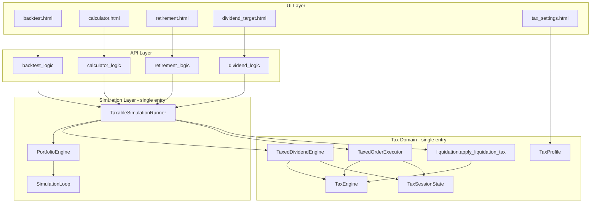
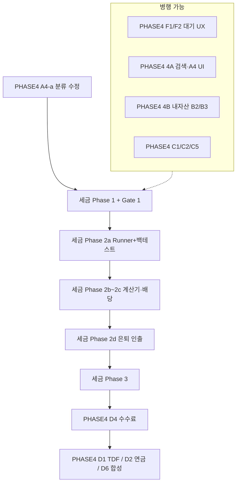

# 세금에서 시작된 완전 리팩토링 계획

## 목표 (North Star)

- **완전**: 위탁 / ISA / 연금저축 / IRP × KR_DOMESTIC / KR_FOREIGN / US_DIRECT / KRX_GOLD × 배당 / 양도 / 종합과세 / 만기·수령 — 모든 조합이 정의된 규칙대로 동작.
- **정확**: 취득단가·연간 누계(YTD)·손익통산·공제 중복 없음. `tax_truth_test.py`가 단일 진실 공급원(SOT).
- **확장 가능**: 새 계좌·자산·세목은 `modules/tax/`에만 추가; 시뮬 화면은 **계산 로직을 복제하지 않음**.
- **코드 품질**: 시뮬 실행 1곳, 세금 계산 1곳, 프로필 1곳.

---

## 현재 문제 요약

### 트리거 버그 (절세매도 체크박스)

1. **절세매도**가 `execute_orders()` 안에서만, **리밸런싱 발생일**에만 실행 → 기본 `rebal_mode: none`이면 무반응.
2. **백테스트 청산세**가 `(최종자산 − 총납입) × 비중` 근사 → 취득단가·절세매도 무시.

### 구조적 부채 (정확도·확장성)

| 문제 | 영향 |
|------|------|
| 세금 엔진 **2벌** (`modules/tax/*` vs `modules/sim/tax_engine.py`) | 배당 역산·미래 기능 불일치 |
| 시뮬 루프 **2벌** (`SimulationLoop` vs `DividendSimulator._simulate_one`) | 동일 입력 다른 세후 결과 |
| 청산세 로직 **2벌** (backtest 근사 vs accumulation 미실현) | 화면마다 다른 최종 자산 |
| `TaxProfile` 미통일 (earned_income만, isa_type 고정) | 종합과세·서민형 ISA 오류 |
| 은퇴 인출·배당 역산 세금 미연결 | 세금 ON이어도 세전과 동일 |

---

## 목표 아키텍처



### 디렉터리 (신규·정리)

```
modules/tax/
  base_tax.py          # 순수 세금 계산 (기존 TaxEngine)
  account_tax.py       # 계좌 규칙, TaxedDividendEngine
  profile.py           # NEW TaxProfile.from_request(body, stored_settings)
  session.py           # NEW TaxSessionState (ytd_financial, ytd_us_cg, year)
  liquidation.py       # NEW apply_liquidation_tax(portfolio, prices, engine, session, account)
  policies/            # NEW (선택) 계좌별 Policy 클래스로 확장
    trust.py
    isa.py
    pension.py
```

```
modules/simulation/
  taxable_runner.py    # NEW TaxableSimulationRunner.run(config, tax_profile) -> RunResult
```

**삭제 대상 (Phase 2 이후)**: `modules/sim/tax_engine.py`, `DividendSimulator` 내 세금·매수매도 자체 루프(역산 최적화는 runner 위 thin wrapper).

### TaxProfile (모든 API 공통)

```python
@dataclass
class TaxProfile:
    earned_income: float
    other_financial_income: float  # 이자·기타 금융소득 (종합과세 YTD 초기값)
    age: int
    income_type: str               # earned | comprehensive
    isa_type: str                  # general | preferential | none
    account_type: str              # 위탁 | ISA | 연금저축 | IRP
    gain_harvesting: bool
    isa_renewal: bool
```

- 출처: `domino_tax_settings` + 요청 body 오버라이드.
- `TaxedDividendEngine` 초기 `_ytd_income = profile.other_financial_income`.

### TaxSessionState (시뮬 1회당)

- `ytd_financial_income` — 배당 gross 누적 (위탁)
- `ytd_us_realized_gains` — US_DIRECT 실현 차익 (리밸·절세매도)
- `year` — 연도 전환 시 리셋
- 청산 시: `remaining_us_exempt = 2_500_000 - ytd_us_realized_gains`

### TaxableSimulationRunner (단일 진입점)

1. `TaxTrackedPortfolio` 생성
2. `TaxedDividendEngine` + `TaxedOrderExecutor(profile)` 주입
3. `SimulationLoop.run(...)`
4. **12월 마지막 거래일** (또는 매 12월 거래일): `executor.maybe_gain_harvest()` — 리밸과 **분리**
5. `apply_liquidation_tax(...)` → `after_tax_end_value`
6. 반환: `history`, `metrics`, `tax_breakdown` (선택, 디버그·UI용)

모든 `*_logic.py`는 **Runner 호출 + 결과 포맷**만 담당.

---

## 배당 역산 리팩토링 답변

**「메인 세금 계산기에 연결만 하면 되나?」→ 부족합니다.**

- `dividend_logic.py`에 `TaxEngine`만 넣는 것은 **레거시 루프 + 메인 세금**의 반쪽 연결입니다. 시뮬 타이밍(월말 vs 거래일), 리밸런싱, 취득단가가 달라 **여전히 불일치**합니다.
- **권장**: `DividendSimulator`의 `_simulate_one` 핵심을 **`TaxableSimulationRunner` 호출**로 교체. 역산(Monte Carlo)은 runner를 N회 호출하거나, 마지막 1년 배당 합만 runner history에서 추출.
- 성능: 기존 `_sim_cache`는 `(tickers, weights, tax_profile_hash, seed, monthly, years)` 키로 runner 결과 캐싱.

---

## 단계별 실행 계획

### Phase 1 — 공통 세금 코어 + 즉시 버그 (1~2주) ✅ 완료

**목표**: 포트폴리오 분석·계산기·은퇴 적립이 **동일 청산·절세 규칙** 사용.

| 작업 | 파일 | 상태 |
|------|------|------|
| `liquidation.apply_liquidation_tax` 추출 | `modules/tax/liquidation.py` | ✅ |
| `accumulation_analyzer._apply_liquidation_tax` → 공통 함수 위임 | `accumulation_analyzer.py` | ✅ |
| 백테스트·`app.py` 동기 경로 청산세 교체 | `backtest_logic.py`, `app.py` | ✅ |
| `maybe_gain_harvest` + `simulation_loop` 12월 호출 | `order_executor.py`, `simulation_loop.py` | ✅ |
| 청산 시 `ytd_us_realized_gains` 반영 (250만 중복 제거) | `liquidation.py`, `TaxedOrderExecutor` | ✅ |
| `TaxProfile` + API `user_settings` 확장 | — | ⏳ phase1-tax-profile-api |
| 회귀 테스트 | `tests/test_gate1_*.py` | ✅ |

**버그픽스 (Phase 1 후반)**:
- `liquidation.py` KR_FOREIGN 손익통산 제거 → 이익 포지션 개별 15.4% (배당소득세 특성)
- `order_executor.py` US_DIRECT 리밸 손실 `_ytd_us_gains` 미반영 수정 → 손익통산 정확

**Gate 1 결과**: SPY 위탁 harvest off=38,415,192 / on=41,990,905 (±1원) 통과.

**Phase 1 리스크**: 낮음~중간. `simulation_loop`·`order_executor`는 공유 모듈이나 diff 범위가 작고 `tax_truth_test`로 방어 가능.

---

### Phase 2 — 단일 파이프라인 (2~4주, 서브페이즈 + 게이트)

**리스크**: 높음. 한 번에 전 화면 교체 시 회귀 범위를 파악하기 어려움 → **2a→2b→2c→2d** 순서로 쪼개고, 각 단계마다 **Gate 통과 후 다음 진행**.

#### Phase 2a — Runner + 백테스트만 (약 1주) ✅ 완료

| 작업 | 파일 | 상태 |
|------|------|------|
| `TaxableSimulationRunner` 구현 | `modules/simulation/taxable_runner.py` | ✅ |
| `backtest_logic.py`만 Runner 호출로 전환 | `backtest_logic.py` | ✅ |
| `app.py` 동기 백테스트 경로 동일 적용 | `app.py` | ✅ |
| diff 테스트 | `tests/test_gate2a_runner_vs_legacy.py` | ✅ 4/4 pass 1.35s |

**Gate 2a 결과**: harvest off/on 모두 Phase 1 골든값 ±1원 통과.

**구현 특이사항**: Runner에 `tax_engine` 파라미터 추가 (Phase 2b에서 외부 주입 필요).

**배포**: 백테스트만 Runner 사용 가능 (독립 배포).

#### Phase 2b — 계산기 + 은퇴 적립 (약 1주) ✅ 완료

| 작업 | 파일 | 상태 |
|------|------|------|
| `AccumulationAnalyzer._run_rolling()` Runner 전환 | `accumulation_analyzer.py` | ✅ |
| 내부 sim_loop mutation (dividend_engine/executor 교체) 제거 | `accumulation_analyzer.py` | ✅ |
| `_apply_liquidation_tax()` 메서드 제거 (Runner 처리) | `accumulation_analyzer.py` | ✅ |
| diff 테스트 | `tests/test_gate2b_runner_accumulation.py` | ✅ 4/4 pass 3.28s |

**Gate 2b 결과**: AccumulationAnalyzer 단일 윈도 vs 백테스트 ±1원 통과; harvest ON>OFF 방향성 유지.

**구조적 남은 불일치**: ISA 풍차돌리기 경로는 `portfolio_engine.run_simulation()` 유지 (Phase 3 통일 예정). 기능 정확, 구조만 비통일.

#### Phase 2c — 배당 역산 (약 1주)

| 작업 | 파일 |
|------|------|
| `dividend_logic` → Runner 기반 역산 | `dividend_logic.py` |
| `DividendSimulator` 슬림화 (Monte Carlo = Runner N회 + 캐시) | `dividend_simulator.py` |
| `modules/sim/tax_engine.py` 삭제 | — |
| 성능 벤치: 기존 대비 역산 시간 회귀 없음 | `tests/test_dividend_runner_perf.py` (선택) |

**완료 기준**: Gate 2c — tax ON 시 배당세 반영(세전 대비 감소); tax OFF와 동일 입력 시 Phase 2c 이전과 합리적 근접.

#### Phase 2e — 금융소득 종합과세 패널 (약 3~5일)

**배경**: KR_FOREIGN (국내상장 해외 ETF) 청산이익은 배당소득세(15.4% 분리과세)이나, 연간 금융소득 합계가 2천만 초과 시 종합과세 적용 → 근로소득 합산 누진세율 최대 49.5%. 수억 규모 포트폴리오를 시뮬 종료 시점에 일괄 청산하는 것은 비현실적 → **시뮬 end_value는 현행 유지**, 별도 절세 안내 패널 추가.

| 작업 | 파일 |
|------|------|
| 백테스트·계산기 결과 페이지: KR_FOREIGN 이익 > 2천만 시 경고 배지 노출 | 각 template |
| `tax_breakdown` 에 `kr_foreign_unrealized_gain` 필드 추가 | `taxable_runner.py`, `liquidation.py` |
| 분할매도 절세 계획 패널: n년 분산 매도 시 총 세금·절감액 계산 | `modules/tax/split_sale_planner.py` (NEW) |
| 패널 UI (접기/펼치기, 연도수 슬라이더) | JS |

**절세 패널 계산 로직**:

```python
# split_sale_planner.py
def compute_split_sale_plan(
    kr_foreign_gain: float,    # 청산 시 KR_FOREIGN 미실현 이익 합계
    earned_income: float,       # 유저 근로소득
    other_financial_income: float = 0.0,  # 기존 금융소득(이자 등)
    split_years: int = 5,       # 분할 매도 연수
) -> dict:
    """
    n년 균등 분할 매도 시 총 배당소득세 계산.
    각 연도: (kr_foreign_gain / n) + other_financial_income 기준.
    2천만 이하 → 15.4% 분리과세.
    2천만 초과 → 초과분 종합과세 (_comprehensive_extra_tax 로직 재사용).
    """
```

반환:
- `lump_sum_tax`: 일괄 청산 세금 (현행 시뮬 기준)
- `split_tax`: n년 분할 시 총 세금
- `saving`: lump_sum_tax - split_tax
- `optimal_years`: 세금 최소화 연수 (1~20년 탐색)

**UI 표시 조건**: 시뮬 종료 시 KR_FOREIGN 미실현 이익 합계 > 2천만원인 경우만 노출.

**시뮬 end_value 변경 없음**: 일괄 청산 기준선 유지. 패널은 "절세 계획" 참고용.

#### Phase 2d — 은퇴 인출 (약 3~5일)

| 작업 | 파일 |
|------|------|
| `WithdrawalAnalyzer` 워커에 TaxedDividendEngine·TaxedOrderExecutor·청산 | `withdrawal_analyzer.py` |
| `RetirementPlanner`에 `TaxProfile` 전달 | `retirement_planner.py`, `retirement_logic.py` |

**완료 기준**: Gate 2d — 위탁/ISA 인출 구간 배당·리밸 CG 반영; 연금 `pension_tax_info`와 시뮬 gross 인출 정합.

**Phase 2 전체 Gate 5**: Gate 2a~2e 모두 통과 + `tax_truth_test` green.

---

### Phase 3 — 정리·확장·문서 (1주, Gate 5 이후만)

| 작업 | 내용 |
|------|------|
| `multi_account.py` | `TaxableSimulationRunner` 사용 또는 미사용 코드 제거 |
| UI | `tax_settings.accounts.harvest` ↔ API `gain_harvesting` 단일 소스 |
| `tax_breakdown` API 필드 | 배당세·양도세·청산세·종합과세 추가 납부 분리 표시 (선택) |
| **ISA 풍차돌리기 Runner 통일** | `AccumulationAnalyzer` ISA renewal 경로 Runner N회 직렬 호출로 전환 |
| E2E | `e2e_test.py` 세금 시나리오 |
| 문서 | `docs/tax-model.md` — 계좌×자산×세목 매트릭스 |

#### ISA 풍차돌리기 Runner 통일 방안 (Phase 3 상세)

현재 `AccumulationAnalyzer._run_rolling()` ISA renewal 분기:
- `portfolio_engine.run_simulation()` 직접 호출 (Runner 미사용)
- 사이클 간 `after_tax_withdrawal()` 적용 후 다음 사이클 초기자산으로 재투입

통일 방안: **Runner N회 직렬 호출**

```python
# 3년 × 사이클수 = N개 Runner 호출
cycle_value = initial_capital
for cycle_start, cycle_end in isa_cycles:  # 3년 단위 슬라이스
    run_result = runner.run(
        config=SimulationConfig(initial_capital=cycle_value, ...),
        price_data=..., dates=..., strategy=...,
        tax_enabled=True, account_type="ISA",
        tax_engine=self.tax_engine,
    )
    # 사이클 말 세후 인출
    cycle_value = tax_engine.after_tax_withdrawal(
        run_result.end_value, "ISA", cycle_contribution, isa_years_held=3
    )
```

- 각 사이클은 독립 Runner 호출 → 완전 통일
- 사이클 간 연결: `after_tax_withdrawal` 결과를 다음 `initial_capital`로
- `isa_years_held=3` 고정 (3년 만기 풍차)

**확장 예시 (Phase 3 이후)**: `policies/trust.py`에 새 규칙 추가 → Runner·Tests만 수정, 화면 무수정.

---

## 커버리지 매트릭스 (완료 시 충족)

### 계좌 × 세목

| | 배당 (원천징수) | 배당 (종합과세 2천만) | 양도 (운용 중) | 양도 (청산) | 청산 종합과세 경고 | 만기/수령 |
|--|:---:|:---:|:---:|:---:|:---:|:---:|
| 위탁 | Runner | Runner + Profile YTD | Runner + Session | liquidation (15.4% 기준선) | 2e: 분할매도 절세 패널 | — |
| ISA | 이연 | — | 0 | after_tax_withdrawal | — | liquidation |
| 연금/IRP | 이연 | — | 0 | after_tax_withdrawal | — | liquidation + pension_rate |

> **KR_FOREIGN 청산 종합과세 주의**: 시뮬 end_value는 15.4% 일괄 적용(강제 청산 기준선). 실제 분할 매도 시 절세 가능 — Phase 2e 패널이 n년 분산 시나리오 안내.

### 자산 (`classify_asset`)

- KR_DOMESTIC, KR_FOREIGN, US_DIRECT, KRX_GOLD — **TaxEngine 단일 분류**, 모든 경로 동일.

### 시뮬 화면

| 화면 | Phase |
|------|-------|
| 포트폴리오 분석 | 1 (청산·절세), 2a (Runner) |
| 투자 계산기 | 1 (청산), 2b (Runner) |
| 은퇴 적립 | 1 (청산), 2b (Runner) |
| 은퇴 인출 | 2d |
| 배당 역산 | 2c |
| 복수 계좌 (multi_account) | 3 |

---

## 코드 전제 검증 (계획 작성 시 확인됨)

| 항목 | 상태 | 위치 |
|------|------|------|
| `_apply_liquidation_tax` | ✅ **추출 완료** → `modules/tax/liquidation.py` | Phase 1 |
| `TaxedDividendEngine` | **존재** | `account_tax.py:158` |
| `TaxEngine.after_tax_dividend` (종합과세) | **존재** | `base_tax.py:153` |
| `TaxedOrderExecutor._do_gain_harvest` | ✅ **구현 완료** | `order_executor.py:220` |
| `TaxableSimulationRunner` | ✅ **구현 완료** | `modules/simulation/taxable_runner.py` |
| `maybe_gain_harvest` | ✅ **구현 완료** | `order_executor.py:208` |
| `modules/sim/tax_engine.py` | **존재** (Phase 2c 삭제 예정) | 레거시 |
| `dividend_logic` tax 주입 | **없음** (Phase 2c 대상) | `dividend_logic.py` |
| KR_FOREIGN 청산 손익통산 | ✅ **수정 완료** — 개별 과세 | `liquidation.py:64` |
| US_DIRECT 리밸 손실 손익통산 | ✅ **수정 완료** | `order_executor.py:170` |

Phase 2 구현 시 **위 표를 먼저 재확인**한 뒤 서브페이즈 착수. 전제 깨지면 계획 수정 후 진행.

---

## 골든 테스트 게이트

고정 입력 JSON을 `tests/fixtures/tax_golden/`에 두고, Phase마다 **자동 diff**. CI 필수.

| Gate | 시점 | 골든 케이스 (최소) | 통과 조건 |
|------|------|-------------------|-----------|
| **Gate 1** | Phase 1 완료 | G1 SPY 위탁 rebal none harvest off/on · G2 SPY monthly rebal · G3 069500 국내형 · G4 360750 KR_FOREIGN | harvest on/off `end_value` 상이; `tax_truth_test` 100% |
| **Gate 2a** | Phase 2a | G1~G2 백테스트 | Runner vs Phase1 legacy `end_value` ±ε |
| **Gate 2b** | Phase 2b | G1 단일 윈도 백테스트=계산기 1케이스 | ±ε |
| **Gate 2c** | Phase 2c | G5 고배당 SCHD/종합과세 경계 · G6 배당 역산 tax on/off | tax on 세후 < tax off; 역산 수렴 |
| **Gate 2d** | Phase 2d | G7 은퇴 연금 IRP 인출 | pension_tax_info 존재, survival_rate 합리 범위 |
| **Gate 5** | Phase 2 전체 | G1~G7 전부 | CI green |
| **Gate 6** | Phase 3 | E2E smoke | `e2e_test.py` 세금 시나리오 |

**ε (허용 오차)**: 정수 원 단위 반올림이면 `end_value` ±1원; CAGR 등 비율은 ±0.0001.

**골든 케이스 상세 (예시 G1)**:
- tickers: `[{code: SPY, weight: 1}]`
- account: 위탁, tax_enabled: true, gain_harvesting: true/false
- start/end: 2015-01-01 ~ 2024-12-31, initial 10M, monthly 0, rebal none, dividend reinvest
- earned_income: 50M, other_financial: 0

---

## 원인 분석 (절세매도 — 참고)

- `gain_harvesting` UI→API 전달은 정상 ([backtest.html](investment-backtest-engine/templates/backtest.html) L486).
- 실행은 [order_executor.py](investment-backtest-engine/modules/execution/order_executor.py) L192–200, 호출은 [simulation_loop.py](investment-backtest-engine/modules/simulation/simulation_loop.py) L136–138 **리밸 시에만**.
- 청산세 근사식: [backtest_logic.py](investment-backtest-engine/backtest_logic.py) L115–138.

---

## 테스트 전략

1. **단위**: `tests/tax_truth_test.py` (기존) + `TaxProfile`/`liquidation` 케이스 추가.
2. **통합**: 계좌×대표 티커(SPY, 069500, 360750) × harvest on/off × rebal none/monthly.
3. **회귀**: CI에서 `tax_truth_test` + integration 필수.
4. **금지**: 화면별 세금 식 복사 — 반드시 `modules/tax/` 경유.

---

## 리스크·완화

| 리스크 | 완화 |
|--------|------|
| Phase 2 big-bang 회귀 | **2a~2d 서브페이즈** + Gate마다 diff 테스트, 화면별 독립 PR |
| 계획 전제와 코드 불일치 | [코드 전제 검증](#코드-전제-검증) 표를 PR 전 체크리스트로 사용 |
| `simulation_loop` 공유 변경 | Phase 1 Gate 1에서 계산기·적립 스모크 포함 |
| 배당 역산 성능 저하 | Phase 2c 전용 캐시 + perf 테스트 |
| 대규모 diff | Phase 1만 머지해도 체크박스·청산 버그 해소 가능 |
| 세법 변경 | `base_tax.py` + 골든 expected 값 업데이트 |

### 현실성 요약 (외부 리뷰 반영)

| Phase | 현실성 | 비고 |
|-------|--------|------|
| Phase 1 | 높음 | 독립 배포 가능, 즉시 사용자 체감 |
| Phase 2a~2b | 중간 | Runner 신규이나 백테스트·적립은 기존 구조와 유사 |
| Phase 2c | 중~낮 | 역산 Monte Carlo + 성능 |
| Phase 2d | 중간 | multiprocessing 워커 주입 |
| Phase 3 | Phase 2 성공 의존 | Gate 5 이후 |

---

## PHASE4_PLAN.md 와의 관계 (검토 2026-05-23)

**결론: 하나로 합치지 않는다.** 성격이 다름.

| 문서 | 성격 | 범위 |
|------|------|------|
| [PHASE4_PLAN.md](investment-backtest-engine/PHASE4_PLAN.md) | 제품 기능 로드맵 (검색·내자산·홈·UX·인프라) | 4A~4F, 수개월 분량 |
| 본 계획 (세금 리팩토링) | 시뮬·세금 **정확도·아키텍처** | `modules/tax/` + `SimulationLoop` 통합 |

PHASE4를 세금 계획에 통째로 넣으면 계획서가 비대해지고, 세금 Gate와 무관한 A2·C5 같은 항목이 섞여 추적이 어려워짐. **대신 실행 순서와 교차 항목만 본 계획에 명시**하고, PHASE4에는 “세금 Phase 1 선행” 메모를 두는 방식이 적절.

### 직접 관련 (세금 리팩토링과 겹침)

| PHASE4 | 관계 | 권장 순서 |
|--------|------|-----------|
| **D3 세금설정 UI** | ✅ 이미 완료. 본 계획 Phase 1 `TaxProfile`이 **저장 필드 확장** (other_financial, isa_type, income_type) | D3 위에 Phase 1 API·프로필 확장 |
| **A4-a 종목 분류** (`KR_STOCK` vs `KRETF`) | `TaxEngine.classify_asset`과 **동일 데이터** — 분류 오류 = 세금 오류 | **Phase 1 전·중** symbol_master + `info_engine` 정리 권장 |
| **A6 암호화폐** | `US_DIRECT`/CRYPTO 분류·시뮬 호환 | Phase 1과 병행 가능, 세금 규칙은 `base_tax`에 명시 |
| **D4 거래수수료** | `fee_engine.py` → `simulation_loop` — **TaxableSimulationRunner**와 같은 파이프라인 | **세금 Phase 2 완료 후** (Runner에 fee 주입 한 번만) |
| **D1 TDF / D2 연금 통합** | `RetirementPlanner`·인출 시뮬 확장 | **세금 Phase 2d(인출 세금) 후** — 안 그러면 세후 수치 이중 작업 |
| **D6 합성 데이터** | `DataPreparer` + `SimulationLoop` | **세금 Phase 2a(Runner) 후** |
| **B5 리밸런싱 검증** | `simulation_loop`·리밸 정확도 — 세금 리팩 전 기준선 | Phase 1 **직전** 또는 Phase 1 Gate에 스모크 포함 |

### 간접 관련 (병행 가능, 시뮬 코어 안 건드림)

- **4A** 검색·종목 UI, **4B** 내자산(스냅샷·경고), **4C** 홈·공유(C5), **4F** Celery 대기 UX → 세금 Phase 1·2와 **병렬** 가능 (단, Phase 1에서 `simulation_loop` 수정 시 회귀 주의).
- **4C4 온보딩** → PHASE4 문서대로 **전체 기능·B4 완료 후** (세금 리팩과 무관).

### PHASE4에 없고 세금 계획만 다루는 것

- 절세매도 12월 분리, 청산세 통일, `TaxableSimulationRunner`, `sim/tax_engine` 삭제, 배당 역산 세금 연결, 종합과세 YTD·프로필 통일.

### 권장 통합 실행 순서 (두 로드맵 합본)



**우선순위 한 줄 요약**

1. **지금 먼저**: 세금 **Phase 1** (체크박스·청산 버그 + `TaxProfile`) — PHASE4 D3은 이미 있으므로 필드만 확장.
2. **Phase 1과 같이 또는 직전**: PHASE4 **A4-a** 분류 (세금 `classify_asset` 정확도).
3. **병렬**: PHASE4 검색·내자산·홈·F1 (시뮬 코어 변경 최소화).
4. **세금 Phase 2 Gate 5 통과 후**: PHASE4 **D4** 수수료 → **D1/D2/D6**.
5. **PHASE4 C4 온보딩**: 맨 마지막.

### PHASE4_PLAN.md에 넣을 한 줄 메모 (구현 시)

> 시뮬레이션·세금 정확도: [세금에서시작된완전리팩토링계획](.cursor/plans) Phase 1 선행. D4·D6·D1/D2는 해당 계획 Phase 2 이후.

---

## 현재 완료 상황 (2026-05-24)

| Phase | 상태 | Gate |
|-------|------|------|
| Phase 1 공통 세금 코어 + 절세매도 분리 | ✅ 완료 | Gate 1 통과 |
| 버그픽스: KR_FOREIGN 손익통산 제거 | ✅ 완료 | — |
| 버그픽스: US_DIRECT 리밸 손실 추적 | ✅ 완료 | — |
| Phase 2a: TaxableSimulationRunner + 백테스트 | ✅ 완료 | Gate 2a 통과 |
| Phase 2b: AccumulationAnalyzer Runner 전환 | ✅ 완료 | Gate 2b 통과 |
| Phase 1 TaxProfile API 통일 | ⏳ 미완료 | — |
| Phase 2c: 배당 역산 Runner | ✅ 구현 완료 / ⚠️ Gate 재검증 보류 | SCHD vs TIGER 미국배당다우존스 데이터·백필 불일치 발견 |
| Phase 2d: 은퇴 인출 세금 주입 | ⏳ 대기 | — |
| Phase 2e: 금종세 경고 + 분할매도 절세 패널 | ⏳ 대기 | — |
| Phase 3: 정리·ISA Runner 통일 | ⏳ 대기 | — |

**알려진 미해결 갭**:
- `liquidation.py` KR_FOREIGN 청산 시 종합과세 미반영 → **설계 결정: end_value는 15.4% 기준선 유지, Phase 2e 분할매도 패널로 절세 시나리오 안내**
- `TaxedDividendEngine._ytd_income` 초기값 = 0 고정 (other_financial_income 미주입) → phase1-tax-profile-api에서 해결
- ISA 풍차돌리기 Runner 미통일 (구조만, 기능 정확) → Phase 3
- Phase 2c Gate 검증 중 `SCHD`와 `TIGER 미국배당다우존스(458730)` 결과 불일치 발견. 원인은 세금 Runner보다 데이터/백필 계층에 가까움:
  - `DJUSDIV100` 장기 가격 데이터 부족 또는 불완전
  - 한국 U.S. Dividend Dow Jones ETF가 짧은 실측 데이터만으로 synthetic 통계 생성
  - `dividend_simulator._calc_div_stats()` 가격수익률 통계에 현재 미완료 연도 포함
  - 백필/합성 row provenance 부재
  → `ETF_BACKFILL_ARCHITECTURE_PLAN.md` Phase 0~1, `SYNTHETIC_DATA_INTEGRATION_PLAN.md` Phase 0~2 선행/병행 후 Gate 2c 재검증.

---

## 다음 액션

**우선순위 1**: `PROJECT_MASTER_ROADMAP.md` 기준으로 백필/합성 데이터 안정화 1차 조치.  
실행 지시: 「마스터 로드맵의 Immediate Track A 진행해줘」.

**우선순위 2**: 데이터 보정 후 Phase 2c Gate 재검증.  
실행 지시: 「Phase 2c Gate 재검증해줘」.  
각 Phase 완료 시 해당 **Gate** CI 통과를 머지 조건으로 삼음.
